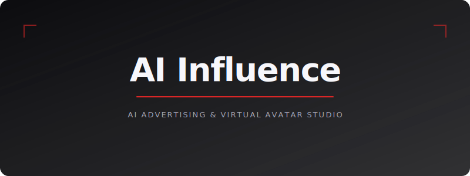
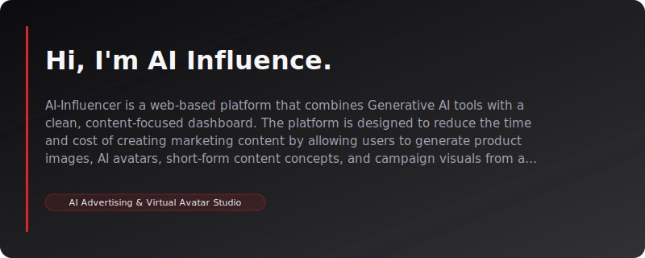
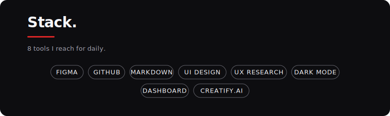

  

# 🤖 AI-Influencer: AI Advertising & Virtual Avatar Studio

> A redesigned AI-powered advertising platform concept inspired by Creatify.ai, created for generating product ads, UGC-style content, virtual avatars, and campaign-ready marketing visuals in one modern dashboard.

---

  

## 📌 Project Overview

**AI-Influencer** is a web design project for an AI-powered advertising content creation platform inspired by **Creatify.ai**. The project adapts the concept of an AI advertising platform into a redesigned interface with additional page structures and interface components that better support digital marketing workflows.

The main concept of this project is to create an **AI Creative Studio** where users can generate, manage, and preview advertising content within one unified system. This includes product visuals, UGC-style content, virtual avatars, and campaign materials for social media platforms.

The platform is designed for modern digital users such as brand owners, marketers, creators, and advertising teams who want to reduce production time, lower content creation costs, and manage large amounts of marketing content more efficiently.

---

## 🎯 Objective

### Problem

Today, creating advertising content for social media often requires a large amount of time, budget, and resources. This may include product photography, hiring influencers, producing UGC videos, editing content, and designing media for different platforms.

For small businesses, online sellers, or creators with small teams, this process can be expensive and time-consuming. Users may also need to rely on multiple separate tools, such as design software, editing tools, image generation platforms, and campaign management systems.

### Solution

**AI-Influencer** is designed as a prototype platform that brings AI advertising tools together in one dashboard. The goal is to create a simple, modern, and efficient user experience for managing large amounts of content.

The system is designed to support different types of content and features, such as:

- Product Ads
- UGC-style Content
- AI Avatar / Virtual Influencer
- Campaign Preview
- Social Media Card
- Content Gallery
- Analytics Overview

By using **Grid Layout** and **Card UI**, the platform makes content organization more structured. Users can view an overview of their work, compare generated assets, and select suitable content for their campaigns more easily.

---

## 🔍 Inspiration & Reference

This project is inspired by **Creatify.ai**, a platform that uses AI for advertising tasks such as generating product videos, creating UGC-style content, using virtual avatars, and producing marketing content for online platforms.

However, **AI-Influencer** is not a direct copy of the reference website. Instead, it analyzes the core concept and redesigns it with a new interface structure, additional system components, and a visual direction that gives the project its own identity.

The redesigned and added elements include:

- A dashboard structure focused on managing large amounts of content
- A dedicated section for Virtual Avatar Studio
- Social Media Card Preview design
- Categorized content management through Sidebar Navigation
- A visual direction suitable for an AI-powered platform
- Presentation of the platform as an AI Creative Workspace

---

## 🎨 Design Strategy

### 🌙 Visual Style: Premium Dark Creative Dashboard

This project uses **Dark Mode** as the main visual style to create a modern, futuristic, and professional appearance suitable for AI, content creation, and digital marketing platforms.

Dark Mode works well for image-heavy and video-heavy interfaces because it helps reduce eye strain during long usage sessions. It also allows product visuals, avatars, and advertising content to stand out more clearly against the background.

In addition, the combination of a dark background with orange accents creates a sense of creativity, energy, and technology, which aligns with the concept of an AI-driven platform.

---

## 🖋 Typography

- **Bebas Neue**  
  Used for main headings or highlighted text to create a bold, strong, and modern visual identity.

- **Poppins**  
  Used for body text, details, and general interface content because it is clean, readable, and suitable for dashboard interfaces.

The combination of these two fonts creates a balance between strong visual impact and readability.

---

## 🎨 Color Palette

The visual identity of **AI-Influencer** uses a dark base with orange accents to create a futuristic, creative, and AI-driven feeling.

  
  
  
  

  
  
  

- `#111214` — Main dark background  
- `#F97316` — Primary orange accent  
- `#FFFFFF` — Main text color  
- `#B5B5B5` — Secondary text color  
- `#FEA05F`, `#FF8430`, `#FF6800` — Orange gradient set for buttons, highlights, and AI visual effects

---

## ✨ Key Interface Features

### 1. AI Content Dashboard

The dashboard is designed as the central workspace of the platform. Users can view an overview of content, campaigns, and AI tools from one main screen.

This section allows users to quickly access core features such as product visual generation, avatar creation, content preview, and campaign management.

---

### 2. Product Ads Generator

This section is designed to support the creation and preview of product advertising images or videos. It focuses on presenting products in a modern and attractive way for use on social media platforms and online advertising channels.

The layout provides space for product visuals, advertising text, and campaign-related details.

---

### 3. Virtual Avatar Studio

The **Virtual Avatar Studio** is a workspace for creating and managing virtual avatars or virtual influencers that can be used in advertising content.

These avatars can represent a brand, appear in UGC-style videos, or support modern marketing campaigns without requiring real people for production.

---

### 4. UGC Content Preview

UGC-style content is a form of advertising that feels like it was created by real users. This style is suitable for platforms such as TikTok, Instagram Reels, and Facebook Ads.

In this project, the preview section is designed to help users see how their content may look before publishing. It uses a card-based layout inspired by social media posts to make the content easier to understand and evaluate.

---

### 5. Content Grid System

The grid system is designed to support a large amount of content, including vertical images, horizontal videos, product visuals, and avatars.

Using **Grid Layout** and **Card UI** helps users organize, search, and compare content more easily while keeping the dashboard visually consistent and structured.

---

### 6. Social Media Card View

This feature displays content in a card format similar to social media posts. It helps users evaluate how generated content may appear when used in real social media or advertising placements.

The card view makes content easier to scan, organize, and manage when multiple assets are displayed on one screen.

---

### 7. Categorized Sidebar Navigation

The sidebar navigation is designed to clearly separate different sections of the platform, allowing users to move between tools quickly and smoothly.

Example navigation items include:

- Dashboard
- Avatar Studio
- Product Ads
- UGC Content
- Campaigns
- Analytics
- Content Gallery
- Settings

This structure makes the system feel professional and suitable for a multi-feature AI advertising platform.

---

## 🛠️ Tools & Technologies

  

This project uses eight main tools and design directions: **Figma, GitHub, Markdown, UI Design, UX Research, Dark Mode, Dashboard, and Creatify.ai**. These elements support the design and presentation of an AI advertising platform prototype.

- **Figma** — Used for designing the UI, components, and design system  
- **GitHub** — Used for storing and presenting the project  
- **Markdown** — Used for writing and formatting the README.md documentation  
- **UI Design** — Used for designing the visual interface and website components  
- **UX Research** — Used for analyzing user needs and the structure of the reference platform  
- **Dark Mode** — Used as the main visual style of the interface  
- **Dashboard** — Used as the main structure of the platform  
- **Creatify.ai** — Used as the reference website and inspiration for the project  

---

## 🧠 Target Users

The target users of this project include:

- Online business owners
- Product brands
- Digital marketers
- Content creators
- Social media managers
- Advertising teams
- Users who want to create AI-powered content
- Users who want to reduce advertising production costs

This platform is suitable for users who want to create marketing content faster without needing a large production team.

---

## 📊 Expected Outcome

The expected outcome of this project is a modern, easy-to-use website prototype that clearly presents the concept of an AI advertising platform.

This project demonstrates how AI can help reduce the workflow of advertising content creation, and how effective UI/UX design can make large-scale content management easier and more organized.

The README also works as a presentation document that explains the concept, design direction, and key features of the project, allowing readers to understand the overall idea without needing to view the full website immediately.

---

## 🚀 Future Development

In the future, this project can be further developed in several ways, such as:

- Adding an AI video generation system from product URLs
- Adding AI-generated captions and advertising scripts
- Adding platform selection for TikTok, Instagram, or Facebook
- Adding saved content and content categorization features
- Adding a Brand Kit system for managing brand colors, fonts, and style
- Adding content performance analytics
- Adding team collaboration features
- Adding multi-platform export options

---

## 📌 Conclusion

**AI-Influencer** is an AI advertising platform design project inspired by Creatify.ai and redesigned with its own interface structure and visual direction.

The project focuses on creating a **Premium Dark Dashboard** experience that supports multiple types of advertising content, such as Product Ads, UGC Content, Virtual Avatar, and Campaign Preview.

Overall, this project demonstrates how Generative AI concepts can be applied to modern website design and digital marketing. It also reflects a UI/UX design approach that focuses on modern visuals, organized structure, and practical usability.

---

  

